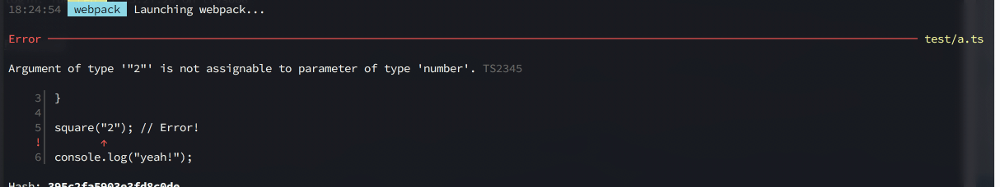

TypeScript Error Formatter
==========================

Installation
------------


```bash
yarn add -D @becklyn/typescript-error-formatter
```


Usage
-----

Add the formatter in your `ts-loader` config:


```js
const formatter = require("@becklyn/typescript-error-formatter"); 

const config = {
    module: {
        rules: [
            {
                test: /\.tsx?$/,
                use: [
                    babelLoader,
                    {
                        loader: "ts-loader",
                        options: {
                            // ↓ ↓ ↓
                            errorFormatter: (message, colors) => formatter(message, colors, process.cwd()),
                            // ↑ ↑ ↑
                        },
                    },
                ],
            },
        ],
    },
};
```


Design
------

The design is inspired by Flow:


